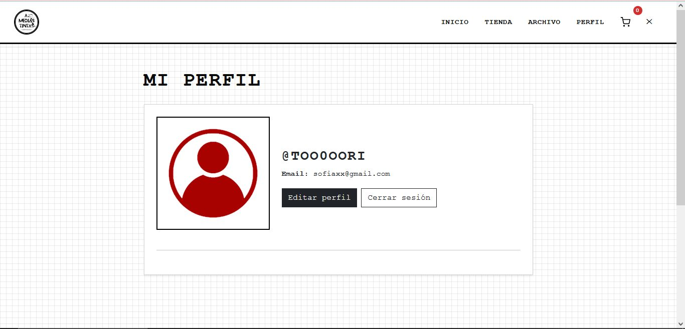

# 🎨 A Medias Tintas - E-commerce Django

Proyecto de e-commerce de poleras estampadas con estética punk, anime y varias, desarrollado con Django.

---

## 📋 Tabla de Contenidos
- [Descripción](#descripción)
- [Tecnologías](#tecnologías)
- [Instalación](#instalación)
- [Estructura del Proyecto](#estructura-del-proyecto)
- [Requerimientos Cumplidos](#requerimientos-cumplidos)
- [Modelos y Relaciones](#modelos-y-relaciones)
- [Desafíos del Desarrollo](#desafíos-del-desarrollo)
- [Capturas](#capturas)
- [Autor](#autor)
- [Licencia](#licencia)
- [Créditos de Imágenes](#créditos-de-imágenes)

---

## 📖 Descripción

**A Medias Tintas** es una tienda online de poleras serigrafiadas/sublimadas inspiradas en:

- Animes de culto (Evangelion, Paprika, Akira, Serial Experiments Lain)
- Bandas shoegaze y punk (My Bloody Valentine, Boris, Sonic Youth)
- Cine de autor (Wong Kar-wai, David Lynch, Truffaut)
- Ilustraciones originales

---

## 🛠️ Tecnologías

- **Backend:** Django 5.2.8
- **Base de Datos:** SQLite3
- **Frontend:** HTML5, CSS3, Bootstrap 5.3
- **Python:** 3.x

---

## 🚀 Instalación

### 1. Clonar el repositorio
```bash
git clone https://github.com/too0oori/M7_Portafolio_SofiaLagos
cd a-medias-tintas
```

### 2. Crear entorno virtual
```bash
python -m venv venv
source venv/bin/activate  # En Windows: venv\Scripts\activate
```

### 3. Instalar dependencias
```bash
pip install -r requirements.txt
```

### 4. Configurar la base de datos
```bash
python manage.py makemigrations
python manage.py migrate
```

### 5. Crear superusuario
```bash
python manage.py createsuperuser
```

### 6. Ejecutar el servidor
```bash
python manage.py runserver
```

Acceder a:
- **Frontend:** http://localhost:8000/
- **Admin:** http://localhost:8000/admin/

---

## 📁 Estructura del Proyecto

```
a_medias_tintas/
├── apps/
│   ├── configuracion/      # Configuración del sitio (sin relaciones)
│   ├── productos/          # Catálogo de productos
│   ├── usuarios/           # Autenticación y perfiles
│   └── pedidos/            # Carrito y pedidos
├── config/                 # Configuración Django
├── static/                 # Archivos estáticos (CSS, JS, imágenes)
├── templates/              # Templates HTML
├── media/                  # Archivos subidos por usuarios
├── manage.py
├── requirements.txt
└── README.md
```

---

## ✅ Requerimientos Cumplidos

### Requerimiento 1: Integración Django-Base de Datos

**Configuración en `settings.py`:**
```python
DATABASES = {
    'default': {
        'ENGINE': 'django.db.backends.sqlite3',
        'NAME': BASE_DIR / 'db.sqlite3',
    }
}
```

#### Integración con Base de Datos

Django se conecta a SQLite3 mediante su ORM (Object-Relational Mapping), que traduce 
las operaciones Python a SQL automáticamente. La configuración en `settings.py` define:

- **ENGINE**: Motor de BD (sqlite3, postgresql, mysql)
- **NAME**: Ruta del archivo de base de datos
- El ORM gestiona conexiones automáticamente mediante connection pooling

**Ejemplo de modelo:**
```python
class Producto(models.Model):
    nombre = models.CharField(max_length=200)
    descripcion = models.TextField()
    precio = models.DecimalField(max_digits=10, decimal_places=2)
    stock = models.IntegerField(default=0)
    categoria = models.ForeignKey(Categoria, on_delete=models.CASCADE)
    imagen_principal = models.ImageField(upload_to='productos/')
    fecha_creacion = models.DateTimeField(auto_now_add=True)
    activo = models.BooleanField(default=True)
    destacado = models.BooleanField(default=False)
```

### Requerimiento 2: Modelo Sin Relaciones

```python
class ConfiguracionSitio(models.Model):
    nombre_sitio = models.CharField(max_length=100)
    email_contacto = models.EmailField()
    telefono = models.CharField(max_length=15)
    costo_envio = models.DecimalField(max_digits=10, decimal_places=2)
    envio_gratis_desde = models.DecimalField(max_digits=10, decimal_places=2)
```

### Requerimiento 3: Modelos con Relaciones

**Relación 1:1:**
```python
class Perfil(models.Model):
    user = models.OneToOneField(User, on_delete=models.CASCADE)
    telefono = models.CharField(max_length=15)
    avatar = models.ImageField(upload_to='avatares/')
```

**Relación 1:N:**
```python
class Producto(models.Model):
    categoria = models.ForeignKey(Categoria, on_delete=models.CASCADE)

class Pedido(models.Model):
    cliente = models.ForeignKey(User, on_delete=models.CASCADE)
```

**Relación M:N:**
```python
class Etiqueta(models.Model):
    productos = models.ManyToManyField(Producto, related_name='etiquetas')

class ProductoTalla(models.Model):
    producto = models.ForeignKey(Producto, on_delete=models.CASCADE)
    talla = models.ForeignKey(Talla, on_delete=models.CASCADE)
    stock = models.IntegerField(default=0)
```

### Requerimiento 4: Migraciones

```bash
# Ver estado de migraciones
python manage.py showmigrations

# Crear migraciones después de cambios en models.py
python manage.py makemigrations

# Aplicar migraciones
python manage.py migrate
```

### Requerimiento 5: Consultas ORM

#### Consultas en Producción (views.py)
Las consultas reales del sistema están integradas en las vistas:

```python
# Filtrado básico
Producto.objects.filter(activo=True, destacado=True)

# Filtrado condicional por categoría
qs.filter(categoria_id=categoria)

# Obtención segura de objetos
get_object_or_404(Producto, pk=pk)

# Relaciones Many-to-Many
producto.etiquetas.all()
producto.producto_tallas.all()
```

#### Consultas de Ejemplo (queries.py)
Archivo con consultas didácticas que demuestran capacidades adicionales del ORM:
- `aggregate()` para cálculos estadísticos
- `annotate()` para agregar campos calculados
- `Q()` para búsquedas con OR lógico
- `filter()` con condiciones complejas

**Ubicación:** `apps/productos/queries.py`

### Requerimiento 6: CRUD Completo

**Admin:**
```python
@admin.register(Producto)
class ProductoAdmin(admin.ModelAdmin):
    list_display = ('nombre', 'precio', 'stock', 'activo')
    list_filter = ('categoria', 'activo')
    search_fields = ('nombre', 'descripcion')
```

### Requerimiento 7: Apps Preinstaladas

| App | Uso |
|-----|-----|
| admin | Panel CRUD completo |
| auth | Login/registro/permisos |
| sessions | Carrito de compras |
| messages | Notificaciones flash |
| staticfiles | CSS/JS/imágenes |

---

## 🗂️ Modelos y Relaciones

```
User (Django Auth)
  ├─ 1:1 → Perfil
  ├─ 1:N → Direccion
  └─ 1:N → Pedido

Categoria
  └─ 1:N → Producto

Producto
  ├─ M:N → Etiqueta
  ├─ M:N → Talla (a través de ProductoTalla)
  └─ 1:N → DetallePedido

Pedido
  ├─ 1:N → DetallePedido
  └─ ForeignKey → Direccion

ConfiguracionSitio
  (sin relaciones)
```

---

## 🛠️ Desafíos del Desarrollo

Durante este proyecto aprendí:
- Cómo funcionan las relaciones ManyToMany con tabla intermedia
- La diferencia entre usar sesiones vs modelos para el carrito
- A optimizar consultas con select_related()

---

## 📸 Capturas

### Pantalla de Inicio


### Catálogo


### Categorías


### Carrito


### Perfil


---

## 👤 Autor

**Sofía Lagos / Tori**  
GitHub: [@too0oori](https://github.com/too0oori)  
Email: sofia.lagos.cesped@gmail.com

---

## 📄 Licencia

Este proyecto es de uso académico para la evaluación de portafolio del módulo 7 del Bootcamp de Desarrollo Full Stack Python.

---

## 🎯 Conclusión

Este proyecto demuestra:

- ✅ Dominio de Django ORM
- ✅ Implementación de relaciones de BD complejas
- ✅ CRUD completo con vistas basadas en clases y funciones
- ✅ Uso efectivo de apps preinstaladas de Django
- ✅ Arquitectura MVC bien estructurada

## 📸 Créditos de Imágenes

Imágenes de bandas, películas y animes usadas únicamente con fines académicos y de demostración.

Derechos de autor pertenecen a los respectivos autores/productores.

Gracias a los artistas, estudios y productoras por su trabajo que me encanta <3
